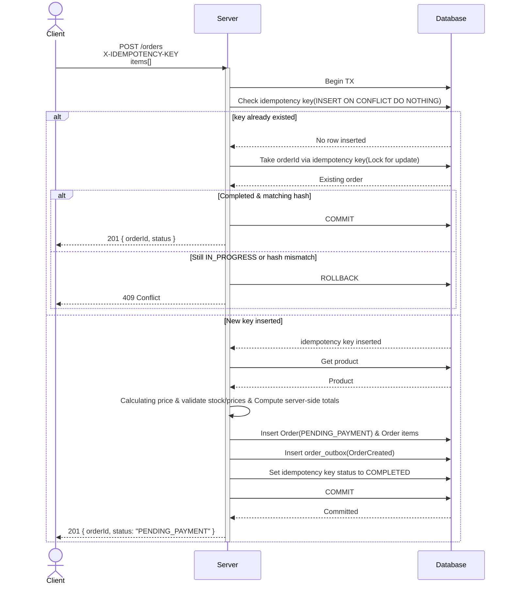
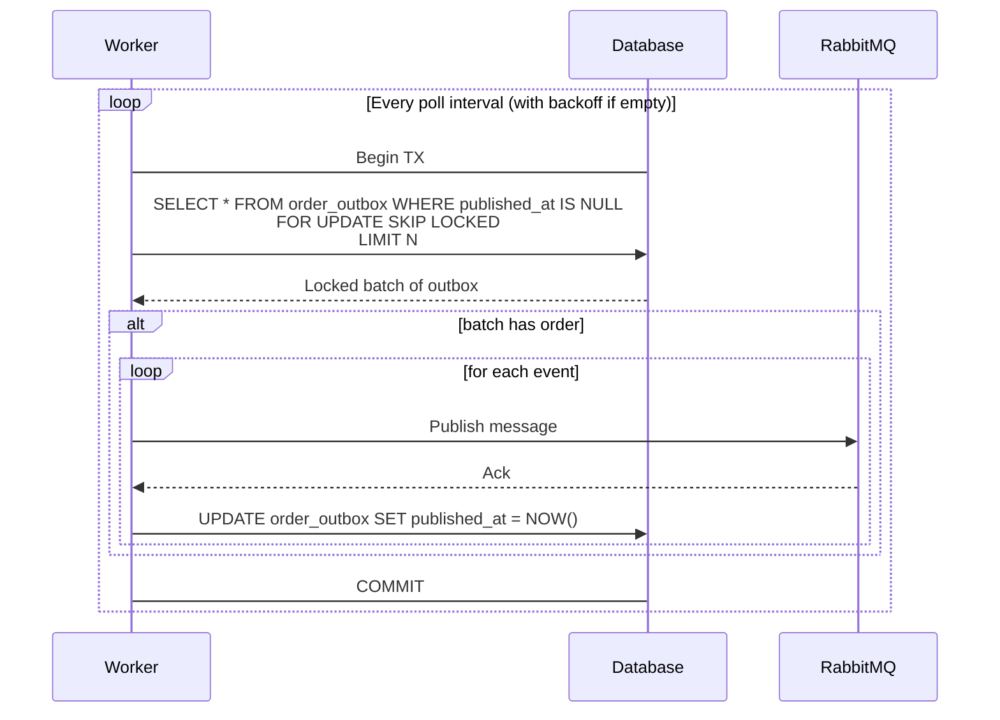

## Store new order to process

```mermaid
sequenceDiagram
actor C as Client
participant S as Server
participant DB as Database

C->>S: POST /orders<br/>X-IDEMPOTENCY-KEY<br/>items[]

activate S
S->>DB: Begin TX
S->>DB: Check idempotency key(INSERT ON CONFLICT DO NOTHING)

alt key already existed
    DB-->>S: No row inserted
    S->>DB: Take orderId via idempotency key(Lock for update)
    DB-->>S: Existing order
    alt Completed & matching hash
        S->>DB: COMMIT
        S-->>C: 201 { orderId, status }
    else Still IN_PROGRESS or hash mismatch
        S->>DB: ROLLBACK
        S-->>C: 409 Conflict
    end
else New key inserted
    DB-->>S: idempotency key inserted
    S->>DB: Get product
    DB-->>S: Product
    S->>S: Calculating price & validate stock/prices & Compute server-side totals
    S->>DB: Insert Order(PENDING_PAYMENT) & Order items
    S->>DB: Insert order_outbox(OrderCreated)
    S->>DB: Set idempotency key status to COMPLETED
    S->>DB: COMMIT
    DB-->>S: Committed
    S-->>C: 201 { orderId, status: "PENDING_PAYMENT" }
end
deactivate S
```

## Queue pending orders to process

```mermaid
sequenceDiagram
participant W as Worker
participant DB as Database
participant RQ as RabbitMQ
loop Every poll interval (with backoff if empty)
    W->DB: Begin TX
    W->>DB: SELECT * FROM order_outbox WHERE published_at IS NULL<br/>FOR UPDATE SKIP LOCKED<br/>LIMIT N
    DB-->>W: Locked batch of outbox

    alt batch has order
        loop for each event
            W->>RQ: Publish message
            RQ-->>W: Ack
            W->>DB: UPDATE order_outbox SET published_at = NOW()
        end
    end
    W->DB: COMMIT
end


```
